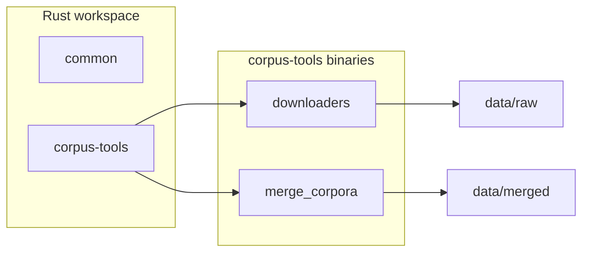

# Architecture

How the SomNLP-Corpus workspace is organized today and how data moves through it.

## Workspace overview

The project is a Cargo workspace with two crates:

```text
somnlp/
├── Cargo.toml              # workspace manifest and shared dependencies
├── crates/
│   ├── common/             # shared types (data contract)
│   └── corpus-tools/       # public dataset download + merge binaries
└── data/                   # corpus artifacts (gitignored)
```



## Crates

### `common`

Shared data types used across the project. Today this is a minimal `Document`
record matching the JSONL output of the downloaders:

```json
{"text": "Soomaaliya waa dal ku yaal Geeska Afrika."}
```

Some sources also include a `source` tag. The schema will grow as cleaning,
language identification, and deduplication stages are added.

### `corpus-tools`

Library + binaries for fetching public Somali datasets and merging them.

| Module | Role |
|--------|------|
| `hf` | Hugging Face API client (list/download shards, auth helpers) |
| `jsonl` | JSONL read/write and document stats |
| `export` | Export helpers for parquet and gzip-json shards |
| `parquet_source` | Read text columns from parquet / gzip-json files |
| `cc100` | CC-100 archive streaming and parsing |
| `mc4`, `madlad`, `mt560` | Per-source shard paths and metadata |
| `cli` | Shared CLI args and summary printing |
| `stats` | Document/character counters |

Binaries live under `crates/corpus-tools/src/bin/`. Each downloader is a thin
CLI wrapper around the library modules.

## Data directories

Large artifacts live under `data/` and are not tracked in git.

| Path | Contents |
|------|----------|
| `data/raw/<source>/` | Per-source JSONL from downloaders |
| `data/merged/` | Combined raw corpus from `merge_corpora` |
| `data/cleaned/` | Reserved for the cleaning stage |
| `data/deduplicated/` | Reserved for deduplication |
| `data/filtered/` | Reserved for language filtering |
| `data/final/` | Reserved for release-ready output |

## Design principles

1. **Streaming first** — downloaders process shards incrementally where possible.
2. **One record per line** — all intermediate artifacts are UTF-8 JSONL.
3. **Thin binaries** — CLI tools delegate to library code in `corpus-tools`.
4. **Grow the schema with the pipeline** — `common` types expand as new stages land.

## What comes next

Planned additions (not yet in the codebase):

- Cleaning and normalization crate
- Language identification and filtering
- Deduplication (exact + near-duplicate)
- Web and Wikipedia collectors
- Unified `somnlp` CLI to orchestrate stages end-to-end

See [DATA_PIPELINE.md](DATA_PIPELINE.md) for the full stage breakdown.
