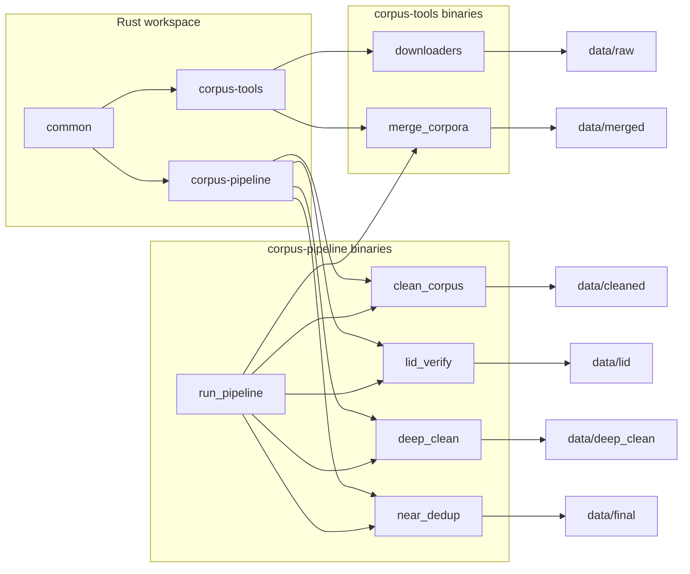

# Architecture

How the SomNLP-Corpus workspace is organized today and how data moves through it.

## Workspace overview

The project is a Cargo workspace with three crates:

```text
somnlp/
├── Cargo.toml              # workspace manifest and shared dependencies
├── configs/
│   └── pipeline.toml       # Phase 3 pipeline knobs (single source of truth)
├── crates/
│   ├── common/             # shared types, hashing, source registry
│   ├── corpus-tools/       # public dataset download + merge
│   └── corpus-pipeline/    # clean, LID, deep clean, near-dedup, stage runner
├── reports/                # per-stage JSON stats (gitignored in practice)
└── data/                   # corpus artifacts (gitignored)
```



## Crates

### `common`

Shared data contract and utilities used by merge and pipeline stages.

| Module | Role |
|--------|------|
| `types` | `RawRecord`, `CorpusRecord`, provenance, quality, dedup metadata |
| `normalize` | `normalize_for_hash` (NFC, trim, collapse whitespace, lowercase) |
| `hash` | `content_hash`, `make_doc_id` |
| `registry` | Track A source keys, classes, LID policy, licenses |
| `reject` | Helpers for reject sidecars (`RecordDisposition`, `QualityFlag`) |

Record shapes are documented in [METADATA_SCHEMA.md](METADATA_SCHEMA.md).

### `corpus-tools`

Library + binaries for fetching public Somali datasets and merging them with
streaming exact dedup.

| Module | Role |
|--------|------|
| `hf` | Hugging Face API client (list/download shards, auth helpers) |
| `jsonl` | JSONL read/write and document stats |
| `export` | Export helpers for parquet and gzip-json shards |
| `parquet_source` | Read text columns from parquet / gzip-json files |
| `cc100` | CC-100 archive streaming and parsing |
| `mc4`, `madlad`, `mt560` | Per-source shard paths and metadata |
| `cli` | Shared CLI args and summary printing |
| `stats` | Document/character counters and dedup counters |

Binaries: six downloaders + `merge_corpora`.

### `corpus-pipeline`

Library + binaries for post-merge processing. Specification:
[CLEANING_PLAN.md](CLEANING_PLAN.md).

| Module | Role |
|--------|------|
| `config` | Load `configs/pipeline.toml` |
| `io` | JSONL streaming, reject sidecars, stats reports |
| `clean` | Eight-step cleaning chain + `CorpusRecord` builder |
| `lid` | Language identification backends + per-class gate policy |
| `deep_clean` | v0.2 normalization, markup/contact, boilerplate, segment LID, intra-doc dedup |
| `near_dedup` | MinHash/LSH, exact-Jaccard verify, keep-longest |

Binaries: `clean_corpus`, `lid_verify`, `deep_clean`, `near_dedup`, `benchmark_lid`, `run_pipeline`.

`run_pipeline` orchestrates stages by invoking sibling binaries in
`target/release/` (or `target/debug/`). It does not depend on `corpus-tools` as a
library — only as a subprocess for `merge_corpora`.

## Data directories

Large artifacts live under `data/` and are not tracked in git.

| Path | Contents |
|------|----------|
| `data/raw/<source>/` | Per-source JSONL from downloaders |
| `data/merged/` | Merged raw corpus (`RawRecord` with `source` tag) |
| `data/cleaned/` | Cleaned `CorpusRecord` JSONL |
| `data/lid/` | LID-verified `CorpusRecord` JSONL |
| `data/deep_clean/` | Deep-cleaned `CorpusRecord` JSONL (v0.2) |
| `data/final/` | Near-deduped release-ready `CorpusRecord` JSONL |

Each stage may write a reject sidecar (`*.rejected.jsonl`) and a stats report under
`reports/`.

## Design principles

1. **Streaming first** — downloaders and most pipeline stages process records incrementally.
2. **One record per line** — all intermediate artifacts are UTF-8 JSONL.
3. **Thin binaries** — CLI tools delegate to library code in their crate.
4. **Grow the schema with the pipeline** — `RawRecord` at merge; full `CorpusRecord` from clean onward.
5. **Preserve rejects** — dropped records go to sidecars, not silent deletion.
6. **Config-driven** — all knobs in `configs/pipeline.toml` for reproducibility.

## What comes next

Planned additions (not yet in the codebase):

- Char-n-gram quality filter (needs Wikipedia-so seed from Track B)
- Web and Wikipedia collectors
- Release packaging (v0.1.0 dataset card, HF upload)

See [DATA_PIPELINE.md](DATA_PIPELINE.md) for stage commands and [ROADMAP.md](../ROADMAP.md)
for milestones.
