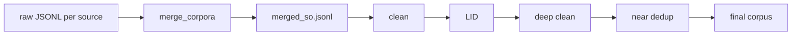

# Merge Semantics

What `merge_corpora` does, what it preserves, and how merged output feeds later stages.

---

## Overview

```text
data/raw/hplt/hplt_so.jsonl  ──┐
data/raw/cc100/cc100_so.jsonl ─┤
data/raw/mc4/mc4_so.jsonl     ─┼──▶ merge_corpora ──▶ data/merged/merged_so.jsonl
…                             ─┘
```

Merge is a **concatenation** step. It does not deduplicate, clean, or transform text.

---

## What merging means

| Property | Behavior |
|----------|----------|
| Operation | Sequential read of each source file, write to one output |
| Text | Copied verbatim (no normalization) |
| Order | Deterministic: order of `--sources` flag, then line order within each file |
| Empty lines | Skipped |
| Empty text | Skipped (`trim` is empty) |
| Missing source file | Skipped with warning; merge continues |
| Deduplication | **None** at merge time |
| Language filtering | **None** at merge time |

Merge produces a **union** of raw documents. Overlap between HPLT, CC100, and mC4
is expected and handled in a later dedup stage.

---

## Metadata survival

### Today (implemented)

| Metadata | In raw JSONL | In merged JSONL | In merge stats |
|----------|:------------:|:---------------:|:--------------:|
| `text` | yes | yes | yes (char count) |
| `source` (per-line tag) | sometimes (MT560) | **no** | yes (per-source doc count) |

**Current gap:** `merge_corpora` calls `write_text_source`, which records the source
key in internal statistics but writes only `{"text": "…"}` to the output file.
Provenance of which file a line came from is **lost** in the merged artifact unless
the source was already embedded in the raw line.

### Target (next merge revision)

Each merged line should include the registry source key:

```json
{"text": "…", "source": "hplt"}
```

This requires a one-line change in the merge writer and is backward-compatible with
`RawRecord`.

---

## Record transformation

Merge performs **no text transformation**:

- No Unicode normalization
- No lowercasing
- No HTML stripping
- No language identification

Records are **copied** (with the source-key gap noted above), not mapped into
`CorpusRecord` yet. Full metadata attachment happens at the **clean** stage when
raw lines become `CorpusRecord` with `id`, `provenance`, `license`, and hashes.

---

## Reproducibility

A merge run is reproducible when:

1. **Input files are unchanged** — same raw JSONL bytes under `data/raw/`
2. **Same source list and order** — `--sources hplt cc100` order matters for output order
3. **Same tool version** — `corpus-tools` release build
4. **No `--limit`** — or the same limit for smoke tests

Future improvement: write a merge manifest alongside output:

```json
{
  "sources": ["hplt", "cc100"],
  "merged_at": "2026-06-10T12:00:00Z",
  "per_source_counts": {"hplt": 966507, "cc100": 396524},
  "total_docs": 1363031,
  "output_sha256": "…"
}
```

---

## Flow into later stages



| Stage | Input | Output | Record shape |
|-------|-------|--------|--------------|
| Merge | `data/raw/*/` | `data/merged/` | `RawRecord` |
| Clean | `data/merged/` | `data/cleaned/` | `CorpusRecord` (initial) |
| LID | `data/cleaned/` | `data/lid/` | `CorpusRecord` + `quality` |
| Deep clean | `data/lid/` | `data/deep_clean/` | `CorpusRecord` + v0.2 flags |
| Near dedup | `data/deep_clean/` | `data/final/` | `CorpusRecord` + `dedup` |

Rejected records from any stage are written to a **sidecar reject file** with full
metadata (see [QUALITY_METADATA.md](QUALITY_METADATA.md)), not deleted.

---

## CLI reference

```bash
merge_corpora \
  --raw-dir data/raw \
  --output data/merged/merged_so.jsonl \
  --sources hplt cc100 mc4 opus madlad mt560
```

Default sources: all six Track A keys in fixed order.
