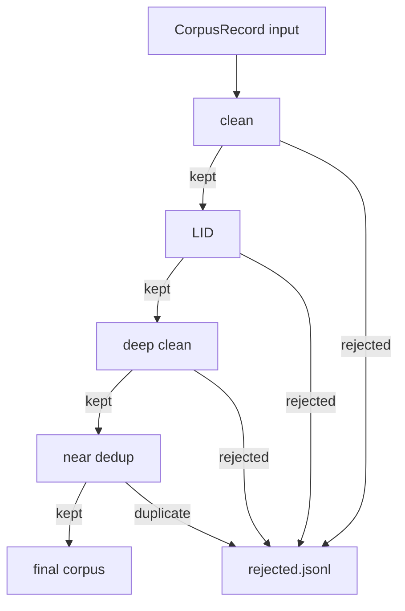

# Quality Metadata

How cleaning, deduplication, and language filtering record decisions — without
deleting failed records.

Rust types: `DedupInfo`, `QualityInfo`, `QualityFlag`, `RecordDisposition`.
See [METADATA_SCHEMA.md](METADATA_SCHEMA.md) for field semantics.

---

## Principle: preserve, don't erase

Low-resource languages lose irrecoverable data when pipelines silently drop records.
SomNLP-Corpus **never deletes** a record from the audit trail:

| Outcome | Where it goes |
|---------|---------------|
| Kept | Primary stage output (`data/cleaned/`, `data/final/`, …) |
| Rejected | Sidecar `*.rejected.jsonl` with full `CorpusRecord` + reason |
| Duplicate | Marked in `dedup`; canonical copy kept, others flagged |
| Review | `disposition = review` for manual inspection |

Rejected files enable later threshold tuning without re-downloading sources.

---

## Dedup metadata (`DedupInfo`)

| Field | Type | Description |
|-------|------|-------------|
| `is_duplicate` | bool | True if this record is a duplicate of another |
| `duplicate_of` | string? | `DocId` of canonical copy (exact match) |
| `near_duplicate_of` | string? | `DocId` of cluster representative (near match) |
| `content_hash` | string? | SHA-256 of normalized text |

### Duplicate status values

| State | `is_duplicate` | Fields set |
|-------|:--------------:|------------|
| Unique | `false` | `content_hash` only |
| Exact duplicate | `true` | `duplicate_of` |
| Near duplicate | `true` | `near_duplicate_of` |

For near-duplicate clusters, keep the **longest** or **highest-quality** representative.
Other cluster members get `is_duplicate: true` and remain in the reject/sidecar stream.

---

## Quality metadata (`QualityInfo`)

| Field | Type | Description |
|-------|------|-------------|
| `disposition` | enum | `kept`, `rejected`, or `review` |
| `flags` | string[] | Reasons for failure or review |
| `lang_score` | f32? | Language-ID confidence in `[0, 1]` |
| `symbol_ratio` | f32? | Non-letter symbol fraction |

### Disposition

| Value | Meaning |
|-------|---------|
| `kept` | Passed all gates for this stage; flows to next stage |
| `rejected` | Failed one or more gates; written to sidecar |
| `review` | Borderline; kept in review queue, not in final corpus |

Default for new records: `kept` until a stage sets otherwise.

---

## Quality flags (`QualityFlag`)

| Flag | Typical stage | Meaning |
|------|---------------|---------|
| `too_short` | clean / validate | Below minimum character or word count |
| `too_long` | validate | Above maximum length |
| `high_symbol_ratio` | validate | Too many symbols/digits vs. letters |
| `low_lang_score` | lang filter | Below Somali confidence threshold |
| `html_remnant` | clean / deep_clean | Residual HTML or markup detected |
| `mostly_numbers` | validate / deep_clean | Digit-heavy content |
| `repeated_ngrams` | validate | Boilerplate / spam patterns |
| `not_somali` | lang filter / deep_clean | Classified as non-Somali |
| `corrupted` | clean | Excessive U+FFFD replacement characters |
| `boilerplate` | deep_clean | Navigation chrome or site boilerplate dominated the text |

Multiple flags may be set on one record.

---

## Per-stage metadata flow

```text
clean       → may set: html_remnant, too_short, corrupted
lid         → sets: lang_score, not_somali, low_lang_score
deep_clean  → may set: boilerplate, html_remnant, not_somali; promotes review → reject
near_dedup  → sets: DedupInfo (is_duplicate, near_duplicate_of, …)
final       → exports only disposition = kept
```



---

## Sidecar reject file format

Same schema as primary output — full `CorpusRecord` JSON lines:

```json
{
  "id": "hplt:a3f8c2…",
  "text": "…",
  "provenance": { "source": "hplt", "collected_at": "…", "lang": "so" },
  "license": "CC0-1.0",
  "content_hash": "…",
  "dedup": { "is_duplicate": false },
  "quality": {
    "disposition": "rejected",
    "flags": ["low_lang_score", "not_somali"],
    "lang_score": 0.12
  },
  "schema_version": 1
}
```

---

## Configuration

Thresholds live in `configs/pipeline.toml` (`[clean]`, `[lid]`, `[deep_clean]`,
`[near_dedup]`). Each release should embed the resolved config hash in the corpus
manifest for reproducibility.
